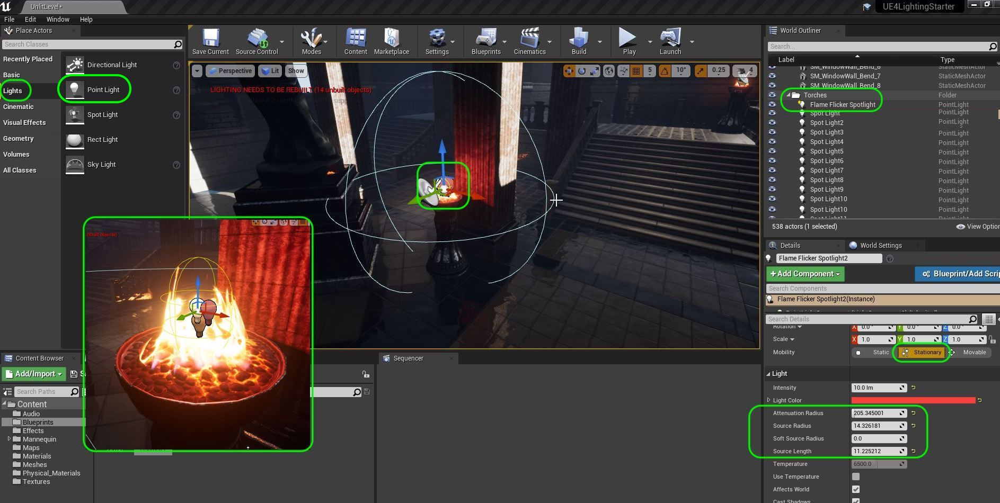
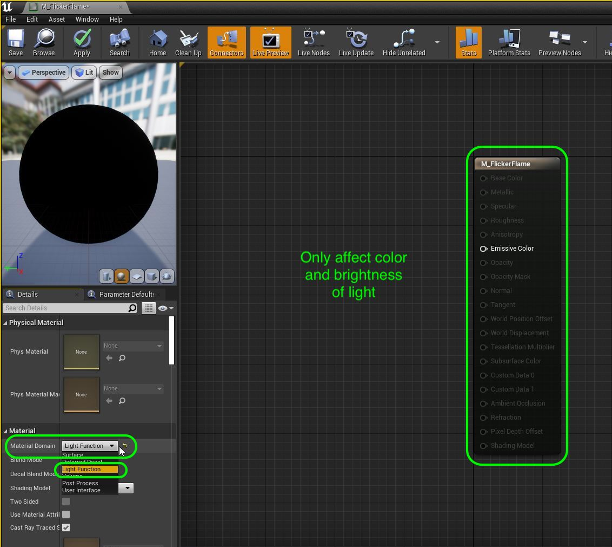
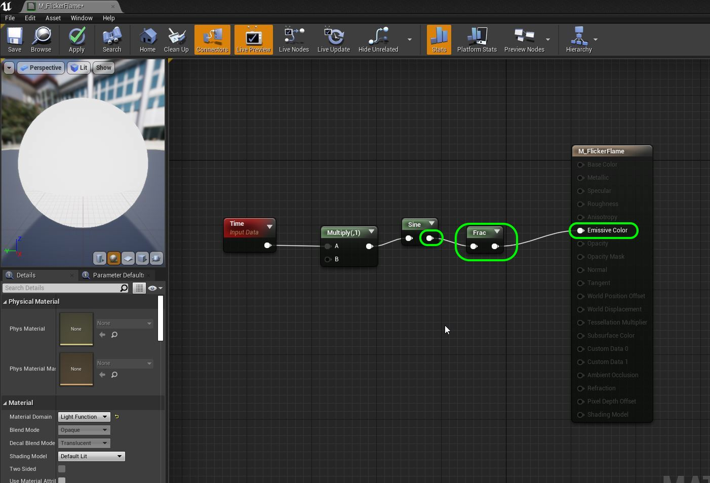
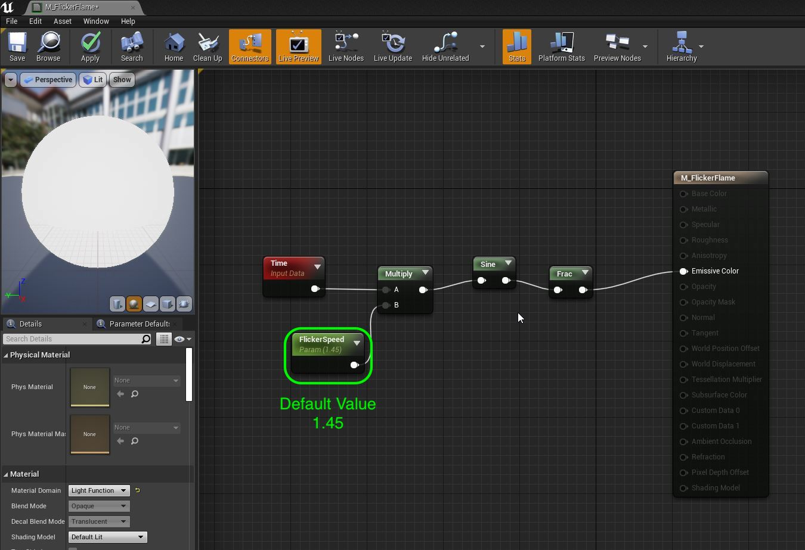
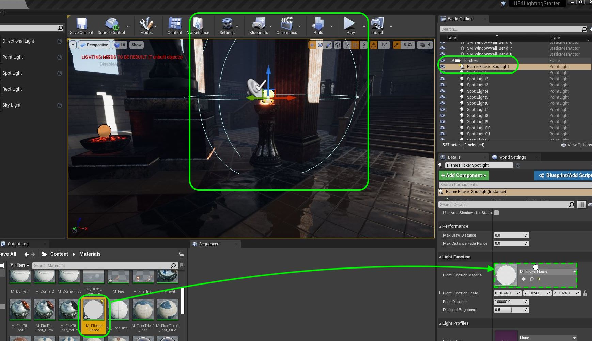
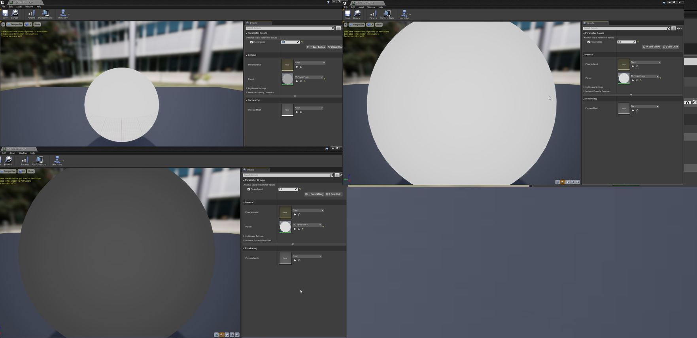
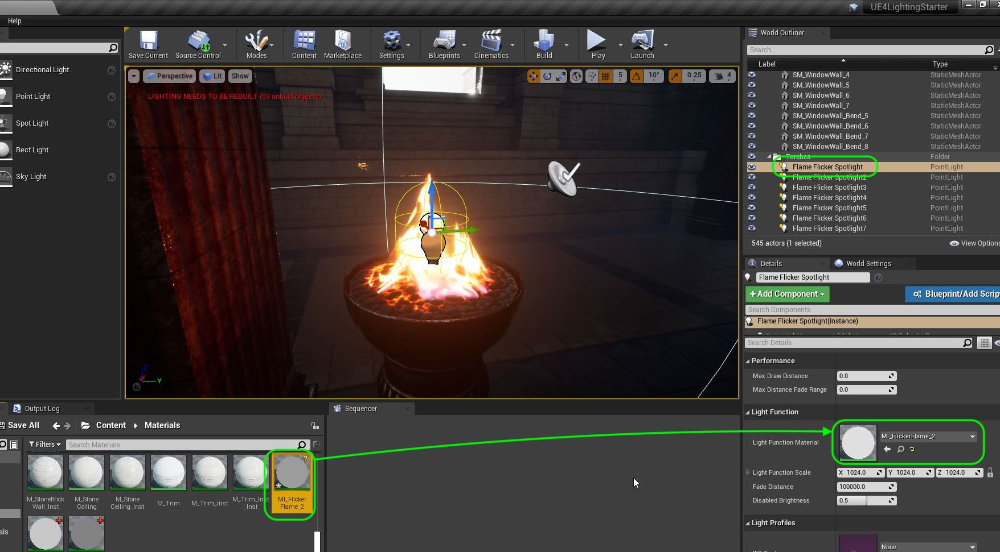
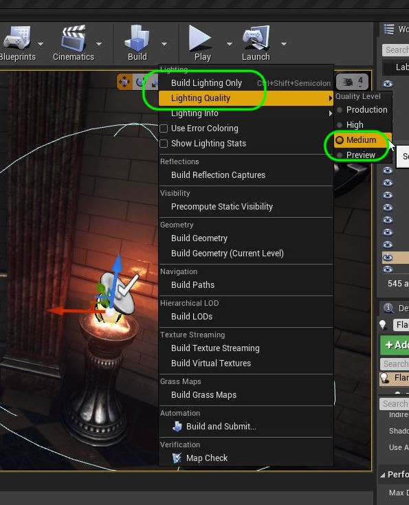

### Light Functions

[previous](../point-lights/README.md#user-content-point-lights) • [home](../README.md#user-content-ue4-lighting) • [next](../)

We are going to turn on an emissive particle system effect for the flames.  We will then create a **Light Function** to animate a flicker on the wall to accentuate what the particle system is already doing and make it look even better!

 

---

##### `Step 1.`\|`ITL`|:small_blue_diamond:

We have another effect that I turned off as it did emit light.  Open up **Materials | M_Fire** and connect the output of the **Multiply** pin into the **Emissive Color** pin in the main shader node.

##### `Step 2.`\|`FHIU`|:small_blue_diamond: :small_blue_diamond: 

I used the same mannequin as the level design assignment and we had the collision volume rendering.  Open up **Blueprints | ThirdPersonCharacter** and select the **Capsule Component**.  Go to **Rendering | Hidden In Game** and select `true` by ticking the box.

##### `Step 3.`\|`ITL`|:small_blue_diamond: :small_blue_diamond: :small_blue_diamond:

Run the game and you will see that some of the torches have a particle flame on top of them.  Look at the flicker.  We will add another light and make it more prominent.

https://user-images.githubusercontent.com/5504953/131667822-4aed95df-9ce8-44d2-9924-599e1bf721bc.mp4

##### `Step 4.`\|`ITL`|:small_blue_diamond: :small_blue_diamond: :small_blue_diamond: :small_blue_diamond:

Lets creat a flickering light for the flames. We want the flames to cast a slightly less saturated yelowish glow that has a flicker in the light. We will create a special kind of material to achieve this look. First start by dropping a **Light | Spot Light** on top of the other one on a torch with a flame. Center it and call it `Flame Flicker Spotlight.` Place it in the **Torches** folder. 

Now this light will not be moving or rotating but we will be affecting its brightness dynamically to simulate a flicker.  So we can't use a **Static** mobility type. We can only use **Stationary** or **Movable**.  Now again this is mainly for the wall and not the player so select `Stationary`.

Pick a color that matches the flame. I adjusted the **Attenuation Radius** to just affect the rear wall.  I chnage the shape to look like a capsule as this matches the shape of the flame better.  This was a combination of **Source Radius** and **Source Length**.

##### `Step 5.`\|`ITL`| :small_orange_diamond:

To preview what it might look like click the **Light | Affect World** setting in the Spot Light to simulate a flicker.  Make any adjustments to the above settings to your taste.

https://user-images.githubusercontent.com/5504953/131670011-b83fecf7-eda9-415f-8114-146486a9e142.mp4

##### `Step 6.`\|`ITL`| :small_orange_diamond: :small_blue_diamond:

Add a new **Material** in **Materials** called `M_FlickerFlame`.

##### `Step 7.`\|`ITL`| :small_orange_diamond: :small_blue_diamond: :small_blue_diamond:

A material normally affects a polygon surface and we can apply a lot of effects to it (normal map, ao, base color, roughness etc...). But we can create a material that affects a light and not a Polygonal surface. Go to **Material Domain** and change it from **Surface** to a `Light Function`. This will now affect a light and how it emits through the **only** channel in the graph is now the **Emissive Color**. We cannot use any other polygonal rendering technique.  This is fine as all we want to do is animate the brightness of the light in an eratic fashion.

##### `Step 8.`\|`ITL`| :small_orange_diamond: :small_blue_diamond: :small_blue_diamond: :small_blue_diamond:

Add a **Time** node to the graph.  This node takes a number from 0 to 1 and back to 0 over time.  This way we can animate it.  Since this is a normalized scalar we can multiply it to speed it up or slow it down.

Add a **Multiply** node and send the output of the **Time** node. This will multiply by 1 (default) which will be the set speed of the time function.  Now send this to a **Sine** node.  This will take it from a linear transition to a ease in and out over a [sine wave](https://en.wikipedia.org/wiki/Sine_wave).  

##### `Step 9.`\|`ITL`| :small_orange_diamond: :small_blue_diamond: :small_blue_diamond: :small_blue_diamond: :small_blue_diamond:

Now right click on the **Sine** node and select **Start Previewing Node**.  Look at the flashing. Another way to look at it is by pressing **Stop Previewing Node**. Connect the output of the **Sine** node to the **Emmissive Color**.  Now this is a very smooth animation and might be ok for police lights.  For a flame we want a more eratic animation.

https://user-images.githubusercontent.com/5504953/131685325-ff8abaf0-e36d-418e-b9e9-ecbb755e9856.mp4

Add a **Frac** node between the **Sine** and the **Emissive Color** nodes.

> The [Frac](https://docs.unrealengine.com/4.26/en-US/RenderingAndGraphics/Materials/ExpressionReference/Math/#frac) expression takes in values and outputs the fractional portion of those values. In other words, for an input value "X", the result is "X minus Floor of X". The output value will range from zero to one, inclusive on the low end, but not the high end. See also Ceil and Floor.  Examples: Frac of (0.2) is (0.2). Frac of (-0.2) is (0.8). Frac of (0.0,1.6,1.0) is (0.0,0.6,0.0) - Unreal Manual

This will give us some apparent randomness to the fades giving more eratic output.

##### `Step 10.`\|`ITL`| :large_blue_diamond:

Now look at the result, it gives us something much closer to what we are looking for. 

https://user-images.githubusercontent.com/5504953/131687015-ab95adc2-a934-4eea-9809-920367c3104a.mp4

##### `Step 11.`\|`ITL`| :large_blue_diamond: :small_blue_diamond: 

One of the big challenges we face is too much symmetry in a level.  If we place all these lights then they will all have the exact same flicker at the same time.  Lets set up the possibility to extend this in a material instance with a variable to adjust the speed.  This way we can ensure that a room doesn't have the same flicker on two flames.

Add a **Vector Parameter** and call it `FlickerSpeed`.  Set the **Default Value** to `1.45`.  This is a good speed.

##### `Step 12.`\|`ITL`| :large_blue_diamond: :small_blue_diamond: :small_blue_diamond: 

Now we can see that we have something usable.  Press the <kbd>Apply</kbd> key.

https://user-images.githubusercontent.com/5504953/131688042-0e1d22c6-1d6b-4302-8b0d-0ca357c51cdd.mp4

##### `Step 13.`\|`ITL`| :large_blue_diamond: :small_blue_diamond: :small_blue_diamond:  :small_blue_diamond: 

Now select the **Flame Flicker Light** Spot Light from the **World Outliner** and drag and drop **M_FlickerFlame** into the **Light Function | Light Function Material**.

##### `Step 14.`\|`ITL`| :large_blue_diamond: :small_blue_diamond: :small_blue_diamond: :small_blue_diamond:  :small_blue_diamond: 

Now play the game and look at the light in action. I find the light much brighter than the flame appears to be.  Lets fix that.

https://user-images.githubusercontent.com/5504953/131690436-807e490c-2095-4e31-8bf2-69ed67beb52a.mp4

##### `Step 15.`\|`ITL`| :large_blue_diamond: :small_orange_diamond: 

I backed off the **Intensity** from `10` to `2` lumens.  This provides a more subtle and realistic effect. The flicker also relects in the mannequin's surface, super cool!

https://user-images.githubusercontent.com/5504953/131690553-f30e19aa-350f-4292-8f1a-b83128bcc5bb.mp4

##### `Step 16.`\|`ITL`| :large_blue_diamond: :small_orange_diamond:   :small_blue_diamond: 

Lets now place 8 more flickering lights (for a total of 9 lights) on the remaining fires.  In my case it is **SM_FirePit_4**, **SM_FirePit_6**, **SM_FirePit_8**, **SM_FirePit_18**, **SM_FirePit_22**, **SM_FirePit_24**, **SM_FirePit_25** and **SM_FirePit_28** (the one I did above was **SM_FirePit2**). Duplicate 8 more lights. Copy and paste the position of the torch with each light and adjust the position. 

https://user-images.githubusercontent.com/5504953/131701352-f6e18cdd-2afb-4141-8e0d-f29f46851764.mp4

##### `Step 17.`\|`ITL`| :large_blue_diamond: :small_orange_diamond: :small_blue_diamond: :small_blue_diamond:

Right click on **M_FlickerFlame** and create 3 **Material Instances**.  Turn on **Flicker Speed** and set it to `1.3`,  `1.6` and `1.8`. Now with the original master material we have 4 different speeds. 

##### `Step 18.`\|`ITL`| :large_blue_diamond: :small_orange_diamond: :small_blue_diamond: :small_blue_diamond: :small_blue_diamond:

Go to all of your **Flame Flicker Spotlight** actors and mix up the **Light Function Materials** assigning an equal amount of the 4.  Make sure no two lights close to each other or in the same vincinity have the same material.

##### `Step 19.`\|`ITL`| :large_blue_diamond: :small_orange_diamond: :small_blue_diamond: :small_blue_diamond: :small_blue_diamond: :small_blue_diamond:

Now you might notice that the generated shadows created in the lighting build are not of high quality.  We have been using a fast preview lighting model.  If you click on the arrow next to the **Build** button, you can adjust the **Lighting Quality** from `Preview` to `Medium`.  We can do this occasionally to get a better sense of how it will look to be more critical of our work.  Press **Build Lighting Only**.

##### `Step 20.`\|`ITL`| :large_blue_diamond: :large_blue_diamond:
 Now run the game and look at all the firelight.  See how it adds a bit of life to the scene.  It is especially important in levels that are fairly bare with few people have enough elements in the scene that look alive to give it some life.  This is a nice addition.  You notice the shadows are better rendered in our baking process.  You can return to a **Preview** lighting quality to make future light builds faster.

##### `Step 21.`\|`ITL`| :large_blue_diamond: :large_blue_diamond: :small_blue_diamond:

___

| [previous](../point-lights/README.md#user-content-point-lights)| [home](../README.md#user-content-ue4-lighting) | [next](../)|
|---|---|---|
