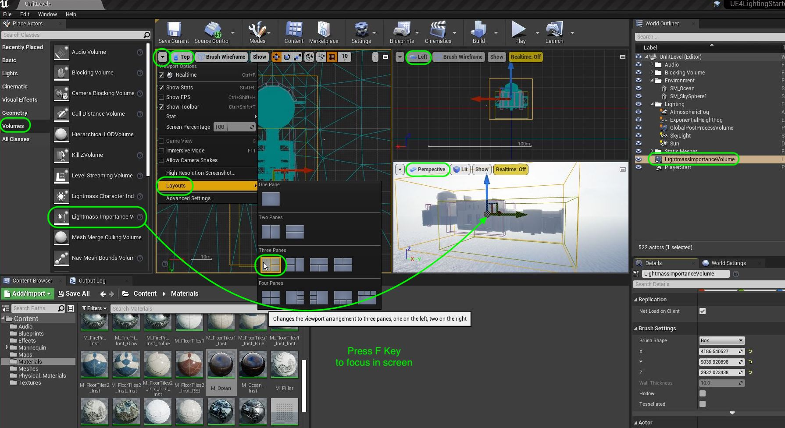
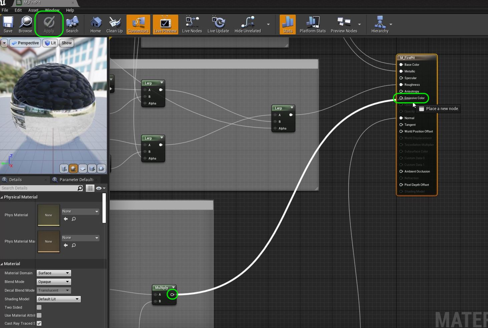
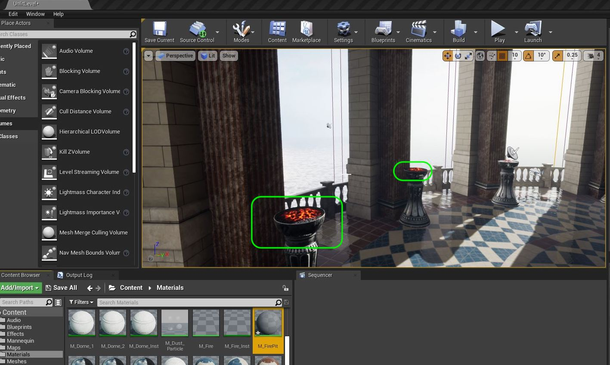
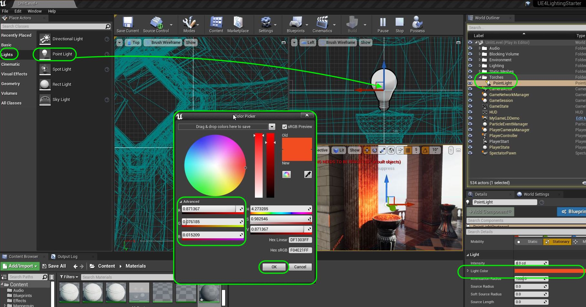
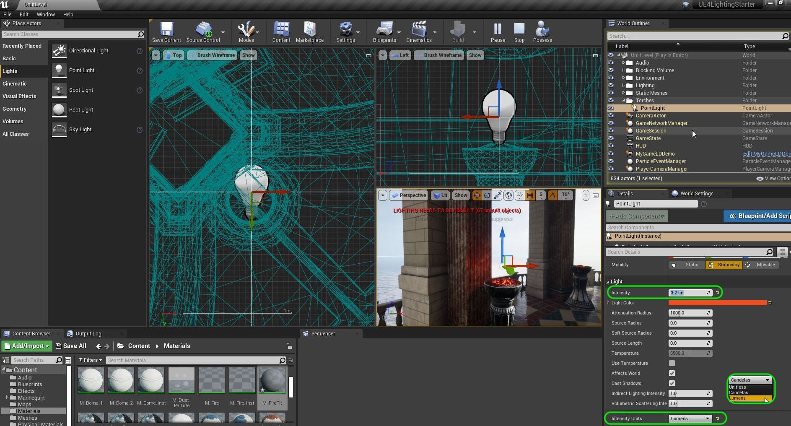
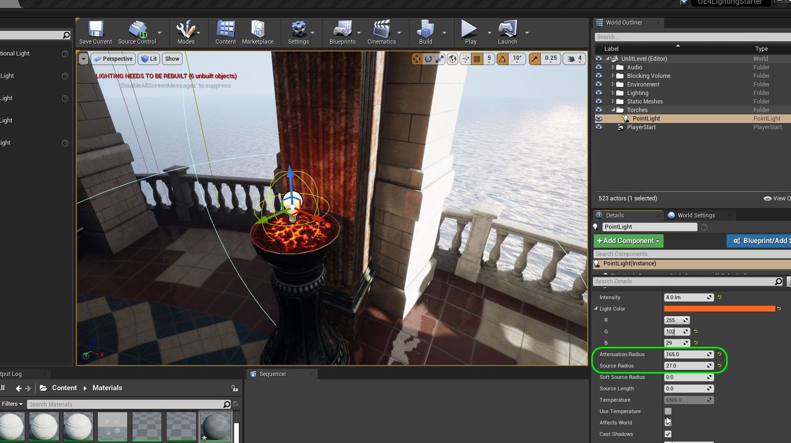

### Point Lights

[previous](../prep/README.md#user-content-lighting-prep) • [home](../README.md#user-content-ue4-lighting) • [next](../)

We need to add a lightmass importance volume so that the game can optimise the lighting processing on the area that the player is navigating in. Lets look at adding light to the flames and embers throughout the level. We will add a static light for the embers and a dynamic one for the flames to add a bit of a realistic flicker. This will be using  a point light.  This is any light source like a lamp or flame that radiates light in all direction. 

 

---

##### `Step 1.`\|`ITL`|:small_blue_diamond:

When buidling lights look for errors in the **Message Log**.  We are getting one in our light buliding stating **! No importance volume found adn the scene is so large...**.  This means that the light baking will not yeild good results.

The issue here is that the sky sphere is 10,000 units large and when it is ray tracing it doesn't have the memory or time to light everything inside it.  This is not necessary as we only are in the building and are blocked from leaving it.

##### `Step 2.`\|`FHIU`|:small_blue_diamond: :small_blue_diamond: 

Add a **Volumes | Lightmass Importance Volume**  into the level.  Press the downward arrow in the top left of the editor game window and select **Layouts | Three Panes** to open up three game windows.  Set one to `Top` the other to `Left` and the third one to `Perspective`.

##### `Step 3.`\|`ITL`|:small_blue_diamond: :small_blue_diamond: :small_blue_diamond:

Now put the **Lightmass Importance Volume** in the **Lighting** folder.  Adjust the **Location** to the center of the building then adjust the **Brush Settings | X | Y | Z** to surround the building.  You don't need to get too close. 

##### `Step 4.`\|`ITL`|:small_blue_diamond: :small_blue_diamond: :small_blue_diamond: :small_blue_diamond:

Press the **Arrow** next to the <kbd>Build</kbd> button and select **Build Lighting Only**. Now we no longer get a pop up with an error.  It is good when lighting to **ALWAYS** check for errors and respond to them in kind.

| `point.lights`\|`UE4 Lighting`| 
| :--- |
| :floppy_disk: &nbsp; &nbsp; For the embers with no flame we will use a point light. This is a light that radiates equally in all directions. *[Point Lights](https://docs.unrealengine.com/4.27/en-US/BuildingWorlds/LightingAndShadows/LightTypes/Point/) work much like a real world light bulb, emitting light in all directions from the light bulb's tungsten filament. However, for the sake of performance, Point Lights are simplified down emitting light equally in all directions from just a single point in space.* |

##### `Step 5.`\|`ITL`| :small_orange_diamond:

Lets turn on another emissive material in the level that is used to represent the embers on the top of the torches.  Open up **M_FirePit** and connect the output of the **Multiply** node to the **Emissive Color** node in the main shader. 

Press the <kbd>Apply</kbd> button.

##### `Step 6.`\|`ITL`| :small_orange_diamond: :small_blue_diamond:

Now you should see some of the torches in the level are glowing.  Lets add a Point Light to light up the surrounding.

##### `Step 7.`\|`ITL`| :small_orange_diamond: :small_blue_diamond: :small_blue_diamond:

Add a **Light | Point Light** to the scene and position it on top of one of the embers that is in the shadows. Add a new folder called `Torches`.  Put the **Point Light** in it. Adjust the color to match the orange/red of the embers the best you can.

##### `Step 8.`\|`ITL`| :small_orange_diamond: :small_blue_diamond: :small_blue_diamond: :small_blue_diamond:

Select the advanced features of lighting (the small arrow at the bottom) and change intensity units to **Lumens**.  Many lights we use day to day are published in lumens so it is a common format. You can also use **Candelas**.  Do not use **Unitless** as this is legacy for old versions to work. Set the value to `3.2` lumens as it is a dim glow that we want.

##### `Step 9.`\|`ITL`| :small_orange_diamond: :small_blue_diamond: :small_blue_diamond: :small_blue_diamond: :small_blue_diamond:

Now lets adjust the **Attenuation Radius**.  This is the distance the light will travel before it no longer affects the world.  It is the distance a light travels.  It is indicated with the light colored sphere.  I set mine to `165`.

I also set the **Source Radius**.  This is how large and what shape is the light emanating from.  It is the entire coal bed so I set mine to `27`.

##### `Step 10.`\|`ITL`| :large_blue_diamond:

##### `Step 11.`\|`ITL`| :large_blue_diamond: :small_blue_diamond: 

##### `Step 12.`\|`ITL`| :large_blue_diamond: :small_blue_diamond: :small_blue_diamond: 

##### `Step 13.`\|`ITL`| :large_blue_diamond: :small_blue_diamond: :small_blue_diamond:  :small_blue_diamond: 

##### `Step 14.`\|`ITL`| :large_blue_diamond: :small_blue_diamond: :small_blue_diamond: :small_blue_diamond:  :small_blue_diamond: 

##### `Step 15.`\|`ITL`| :large_blue_diamond: :small_orange_diamond: 

##### `Step 16.`\|`ITL`| :large_blue_diamond: :small_orange_diamond:   :small_blue_diamond: 

##### `Step 17.`\|`ITL`| :large_blue_diamond: :small_orange_diamond: :small_blue_diamond: :small_blue_diamond:

##### `Step 18.`\|`ITL`| :large_blue_diamond: :small_orange_diamond: :small_blue_diamond: :small_blue_diamond: :small_blue_diamond:

##### `Step 19.`\|`ITL`| :large_blue_diamond: :small_orange_diamond: :small_blue_diamond: :small_blue_diamond: :small_blue_diamond: :small_blue_diamond:

##### `Step 20.`\|`ITL`| :large_blue_diamond: :large_blue_diamond:

##### `Step 21.`\|`ITL`| :large_blue_diamond: :large_blue_diamond: :small_blue_diamond:

___

| [previous](../prep/README.md#user-content-lighting-prep)| [home](../README.md#user-content-ue4-lighting) | [next](../)|
|---|---|---|
