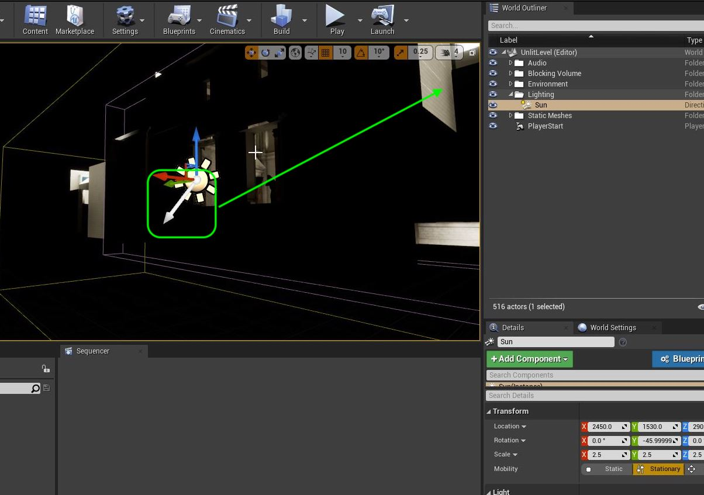

### Lighting Prep

[previous](../setting-up/README.md#user-content-setting-up) • [home](../README.md#user-content-ue4-lighting) • [next](../)

Lets get ready to start lighting the scene. Before we can begin we need to turn on the skybox, water and fog. We need to add a lightmass importance volume so that the game can optimise the lighting processing on the area that the player is navigating in. We will also add a post processing volume to kill the auto iris so that we can light with a fixed exposure. We will rotate the sun to match the skybox.

 

---

##### `Step 1.`\|`SUU&G`|:small_blue_diamond:

Since most of this scene is lit by sun through openings in this structure we will add a ** Place Actors | Lights | Directional Light** to the level. We will also add a folder called `Lighting` to the **World Outliner**. We will rename the light to `Sun` and move it inside the new **Lighting** folder. Ensure the mobility is **Stationary** and we will explain this later.

The placement is irrelevant of where you put the light in the level.  It will light the entire scene.  I have put it next to the building so I don't click on it by accident.  The [Directional Light](https://docs.unrealengine.com/4.27/en-US/BuildingWorlds/LightingAndShadows/LightTypes/Directional/).

> The Directional Light simulates light that is being emitted from a source that is infinitely far away. This means that all shadows cast by this light will be parallel, making this the ideal choice for simulating sunlight. 

##### `Step 2.`\|`FHIU`|:small_blue_diamond: :small_blue_diamond: 

Since this is acting like a light that is infinitely long the only important thing is the angle it is facing (time of day).  So this is the **White Line** that we see.  When we set up the skybox we will adjust this match the sun.

Notice that it is lighting the outside walls in the direction it is facing and leaving hard shadows.  There are no bounces or fills in this scene.

##### `Step 3.`\|`SUU&G`|:small_blue_diamond: :small_blue_diamond: :small_blue_diamond:

Press the **Build** to build the lights.  Now run the game and walk through the level.  You will notice that the front and mid room have outdoor lighting (windows and archways).  The backroom does not have any outside light so it is unlit.

Notice that the scene adapts to the lighting and goes from bright to dark.  We will turn that off while we are lighting then adjust it for final tweaking to our liking at the end.

https://user-images.githubusercontent.com/5504953/131544371-b0dd5838-8dd4-4ca2-be31-68e8a984304e.mp4

##### `Step 4.`\|`SUU&G`|:small_blue_diamond: :small_blue_diamond: :small_blue_diamond: :small_blue_diamond:

We don't want the auto iris exposure built in the game affect our lighting settings.  It is hard to light when it opens up to iris to light the scene. So lets go add a **Volumes | Post Process Volume** to the level.  Go to **Post Process Volume Settings | Infinite Extent** and tick the box to `true`.  We want to have this volume affect every object in the world even if it falls outside this box.

Call it `GlobalPostProcessingVolume` and move it to the **Lighting** folder. 

##### `Step 5.`\|`SUU&G`| :small_orange_diamond:

In **GlobalPostProcessingVolume** go to **Lens | Exposure** and change **Min Brightness** and **Max Brightness** to both be `1.0`.  The tool tip says that if **Min = Max** that **Eye Adaption** is disabled which is what we want!

##### `Step 6.`\|`SUU&G`| :small_orange_diamond: :small_blue_diamond:

Now when we run around we can really see how limiting the directional light is.  There is no fill or spill and it only affects where the sun directly hits.  For indirect lighting we need another lighting actor.

https://user-images.githubusercontent.com/5504953/131555655-3ebac7a5-b681-4f17-9bdc-ed03427e359c.mp4

##### `Step 7.`\|`SUU&G`| :small_orange_diamond: :small_blue_diamond: :small_blue_diamond:

 Add a [Lights | Sky Light](https://docs.unrealengine.com/4.27/en-US/BuildingWorlds/LightingAndShadows/LightTypes/SkyLight/) to the outside of the room (doesn't matter where it goes it affects the entire screen).  Move it to the **Lighting** folder. 

> The Sky Light captures the distant parts of your level and applies that to the scene as a light. That means the sky's appearance and its lighting/reflections will match, even if your sky is coming from atmosphere, or layered clouds on top of a skybox, or distant mountains. You can also manually specify a cubemap to use.

##### `Step 8.`\|`SUU&G`| :small_orange_diamond: :small_blue_diamond: :small_blue_diamond: :small_blue_diamond:

##### `Step 9.`\|`SUU&G`| :small_orange_diamond: :small_blue_diamond: :small_blue_diamond: :small_blue_diamond: :small_blue_diamond:

##### `Step 10.`\|`SUU&G`| :large_blue_diamond:

##### `Step 11.`\|`SUU&G`| :large_blue_diamond: :small_blue_diamond: 

##### `Step 12.`\|`SUU&G`| :large_blue_diamond: :small_blue_diamond: :small_blue_diamond: 

##### `Step 13.`\|`SUU&G`| :large_blue_diamond: :small_blue_diamond: :small_blue_diamond:  :small_blue_diamond: 

##### `Step 14.`\|`SUU&G`| :large_blue_diamond: :small_blue_diamond: :small_blue_diamond: :small_blue_diamond:  :small_blue_diamond: 

##### `Step 15.`\|`SUU&G`| :large_blue_diamond: :small_orange_diamond: 

##### `Step 16.`\|`SUU&G`| :large_blue_diamond: :small_orange_diamond:   :small_blue_diamond: 

##### `Step 17.`\|`SUU&G`| :large_blue_diamond: :small_orange_diamond: :small_blue_diamond: :small_blue_diamond:

##### `Step 18.`\|`SUU&G`| :large_blue_diamond: :small_orange_diamond: :small_blue_diamond: :small_blue_diamond: :small_blue_diamond:

##### `Step 19.`\|`SUU&G`| :large_blue_diamond: :small_orange_diamond: :small_blue_diamond: :small_blue_diamond: :small_blue_diamond: :small_blue_diamond:

##### `Step 20.`\|`SUU&G`| :large_blue_diamond: :large_blue_diamond:

##### `Step 21.`\|`SUU&G`| :large_blue_diamond: :large_blue_diamond: :small_blue_diamond:

___

| [previous](../setting-up/README.md#user-content-setting-up)| [home](../README.md#user-content-ue4-lighting) | [next](../)|
|---|---|---|
