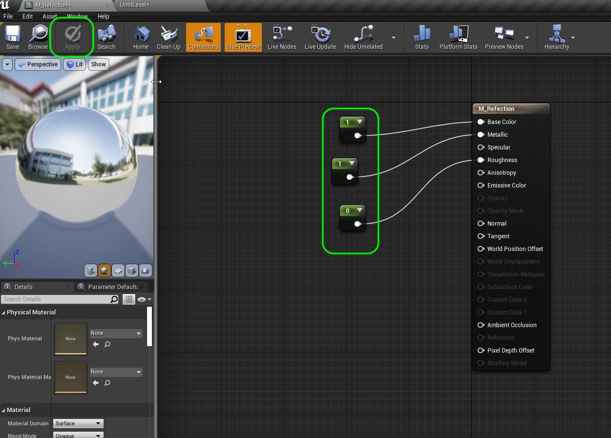
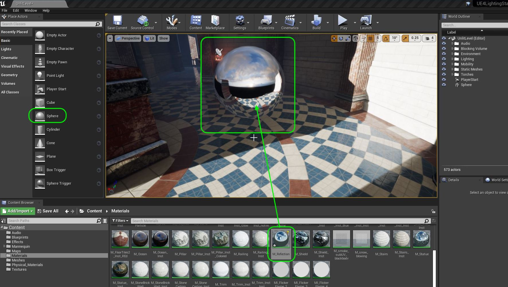
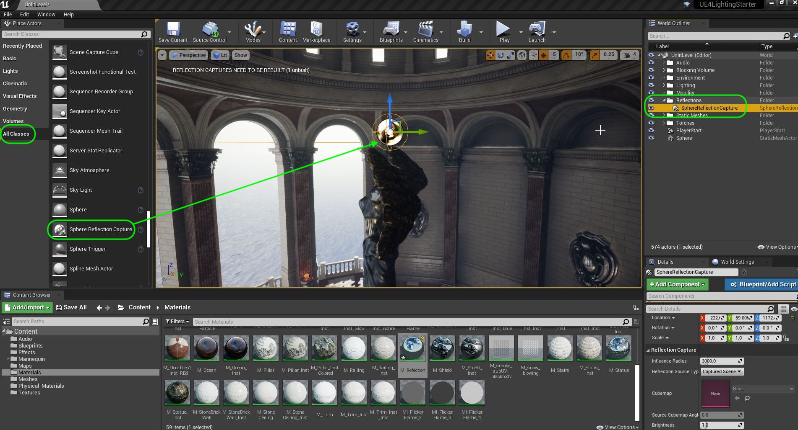
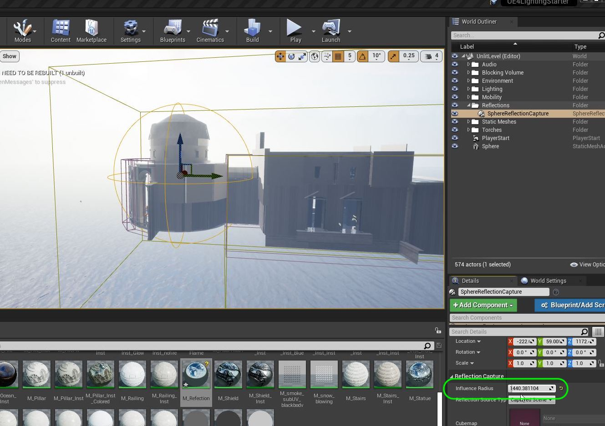
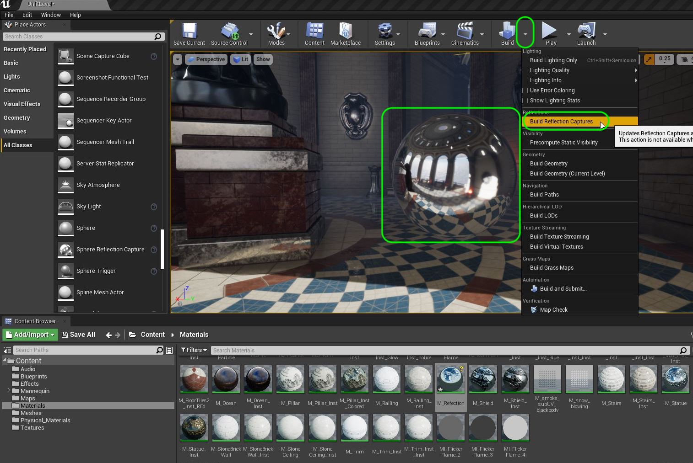
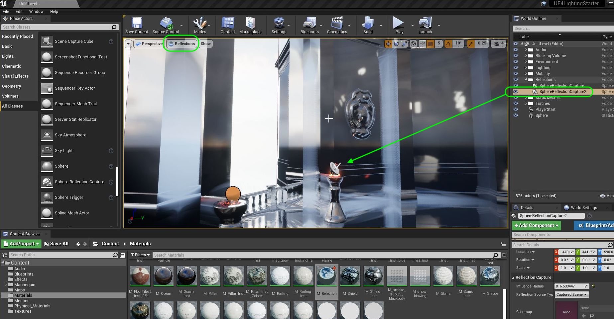
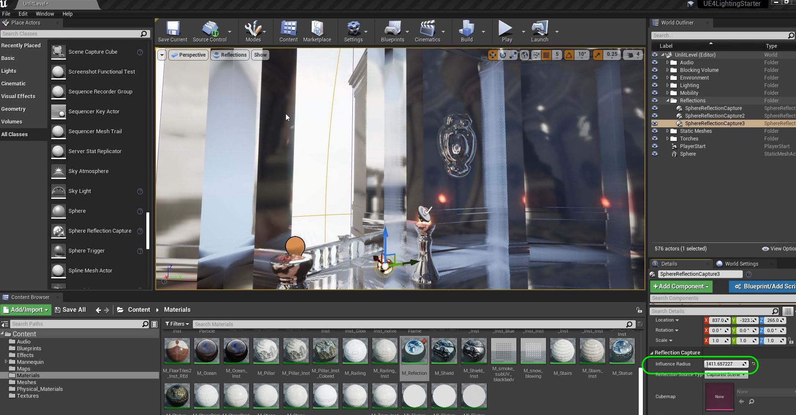

### Reflection Captures

[previous](../dynamics-mobility/README.md#user-content-add-dynamics-to-mobility) • [home](../README.md#user-content-ue4-lighting) • [next](../)

Now before we zero on on any more fine point lighting, we need to address the reflective surfaces in the scene. They get reflections mapped into them and without a Reflection Capture Volume it will reflect the world color (black) back into it making it look unlit. Lets fix this and see how we deal with reflections to help finish lighting the scene.

 

---

##### `Step 1.`\|`ITL`|:small_blue_diamond:

The reflections add a lot to the lighting of a scene especially in reflective surfaces like we have in this level (the VERY reflective floor).  Now Unreal uses reflection maps to cast that image into the scene.

To see what is reflecting select the **Lit** button and switch to **Reflections**.  This shows what will be reflected.  Notice on the gazebo that it is NOT reflecting any geometry but just the sky.  The floor reflects solid sky even though there is a roof on the gazebo.

https://user-images.githubusercontent.com/5504953/131835752-8d8634f7-3dca-4bef-9704-7805efe01895.mp4

##### `Step 2.`\|`FHIU`|:small_blue_diamond: :small_blue_diamond: 

Lets test this out to see if it is what is happening.  Lets put a mirror ball to see the reflections while running the game.  Create a new **Material** in the **Matierals** folder called `M_Reflection`.

Connect a **Constant** of `1` to **Base Color** (pure white), `1` to **Metalic** (pure reflective metal) and `0` to **Roughness** so that it reflects as much light as possible.  Press the <kbd>Apply</kbd> button. You should have a mirror ball

##### `Step 3.`\|`ITL`|:small_blue_diamond: :small_blue_diamond: :small_blue_diamond:

Now add a **Sphere** to the level and put the **M_Reflection** material on it. Change the scale to `2.0, 2.0, 2.0`.  This way we can see it properly. Notice that it is not reflecting the inside of the gazebo (except the floor).

##### `Step 4.`\|`ITL`|:small_blue_diamond: :small_blue_diamond: :small_blue_diamond: :small_blue_diamond:

Now if you play the game and go around the sphere you will notice that it is not reflecting anything but sky and floor.  There is also a black reflection in the horizon.  Not very pleasant!

https://user-images.githubusercontent.com/5504953/131838101-33666902-fca6-49cc-8ff3-7e21b1ce40b0.mp4

##### `Step 5.`\|`ITL`| :small_orange_diamond:

> The [Sphere Reflection Capture](https://docs.unrealengine.com/4.27/en-US/Resources/ContentExamples/Reflections/1_4/) volume is used to capture reflections to reflect into surfaces.   The primarily used reflection capture is the Sphere Reflection Capture. Many of these can be placed around the world with almost no performance impact as they are calculated before run time. - UE4 Manual

Full reflection documentation can be found at [Reflection Environment](https://docs.unrealengine.com/4.27/en-US/BuildingWorlds/LightingAndShadows/ReflectionEnvironment/)

Add a **Sphere Reflection Capture** actor to the gazebo above the statue. Place it in a new folder called **Reflections**.

##### `Step 6.`\|`ITL`| :small_orange_diamond: :small_blue_diamond:

The sphere reflection camera takes a 360 degree shot of where it is centered and uses that for the reflection map.  We want to set the distance it photographs to just beyond the gazebo (It starts to reduce the effect the close you get to the end of the volume). Set the **Influence Radius** to just a bit larger than the gazebo itself. 

##### `Step 7.`\|`ITL`| :small_orange_diamond: :small_blue_diamond: :small_blue_diamond:

Now press the arrow key next the **Build** button and select **Build Reflection Captures**.  Notice that we now see the interior.  There are still some black spots though.

Check out the level with the ball and also switching the **Reflection** view.  This is still showing black reflecting into the scene.

https://user-images.githubusercontent.com/5504953/131840594-b1a8f8dd-45d8-4104-9dd0-54fe5b4a12b3.mp4

##### `Step 8.`\|`ITL`| :small_orange_diamond: :small_blue_diamond: :small_blue_diamond: :small_blue_diamond:

Now we keep refining the process by adding volumes.  What we have to worry about is that the 360 view from the first one will have some areas of occlusion.  The statue blocks it from getting what is behind it.  We need to strategically place them to fill out all voids and avoid issues in transitionp points between volumes.  Clever placed **Sphere Reflection Capture** volumes takes  some trial and error.  Looking at the ball and makin adjustments to the size in **Relections** mode is very helpful.

Add a second reflection capture and switch to **Reflections** view.  Position it between the statue and the wall with the black area at roughly player height (this is the viewpoint the player experiences).  Adjust the size until the reflection is the right scale and replaces the black.  Press the **Build | Build Reflection Caputures** and run around.  I was able to get rid of those black voids I had previously.

https://user-images.githubusercontent.com/5504953/131842299-03bd7852-a0f5-49d7-93f6-e91fec95dda5.mp4

##### `Step 9.`\|`ITL`| :small_orange_diamond: :small_blue_diamond: :small_blue_diamond: :small_blue_diamond: :small_blue_diamond:

Now lets move the camera to the other side of the statue.  I find the reflection map very blurry.  Lets add a third **Sphere Reflection Volume** to this side.

##### `Step 10.`\|`ITL`| :large_blue_diamond:

Now adjust the size of the **Influence Radius** to get a better reflection.

Press the **Build | Build Reflection Caputures** and run around to see the third capture volume.

https://user-images.githubusercontent.com/5504953/131844633-ca242938-fc94-42da-8df7-15c08cf6c980.mp4

##### `Step 11.`\|`ITL`| :large_blue_diamond: :small_blue_diamond: 

##### `Step 12.`\|`ITL`| :large_blue_diamond: :small_blue_diamond: :small_blue_diamond: 

##### `Step 13.`\|`ITL`| :large_blue_diamond: :small_blue_diamond: :small_blue_diamond:  :small_blue_diamond: 

##### `Step 14.`\|`ITL`| :large_blue_diamond: :small_blue_diamond: :small_blue_diamond: :small_blue_diamond:  :small_blue_diamond: 

##### `Step 15.`\|`ITL`| :large_blue_diamond: :small_orange_diamond: 

##### `Step 16.`\|`ITL`| :large_blue_diamond: :small_orange_diamond:   :small_blue_diamond: 

##### `Step 17.`\|`ITL`| :large_blue_diamond: :small_orange_diamond: :small_blue_diamond: :small_blue_diamond:

##### `Step 18.`\|`ITL`| :large_blue_diamond: :small_orange_diamond: :small_blue_diamond: :small_blue_diamond: :small_blue_diamond:

##### `Step 19.`\|`ITL`| :large_blue_diamond: :small_orange_diamond: :small_blue_diamond: :small_blue_diamond: :small_blue_diamond: :small_blue_diamond:

##### `Step 20.`\|`ITL`| :large_blue_diamond: :large_blue_diamond:

##### `Step 21.`\|`ITL`| :large_blue_diamond: :large_blue_diamond: :small_blue_diamond:

___

| [previous](../dynamics-mobility/README.md#user-content-add-dynamics-to-mobility)| [home](../README.md#user-content-ue4-lighting) | [next](../)|
|---|---|---|
