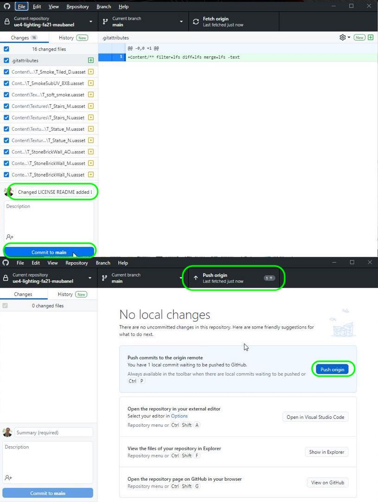
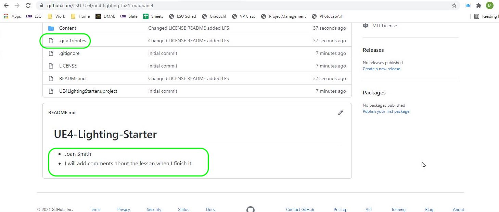
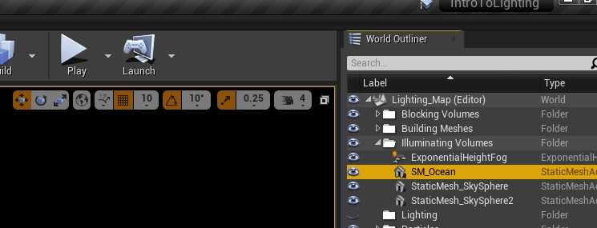
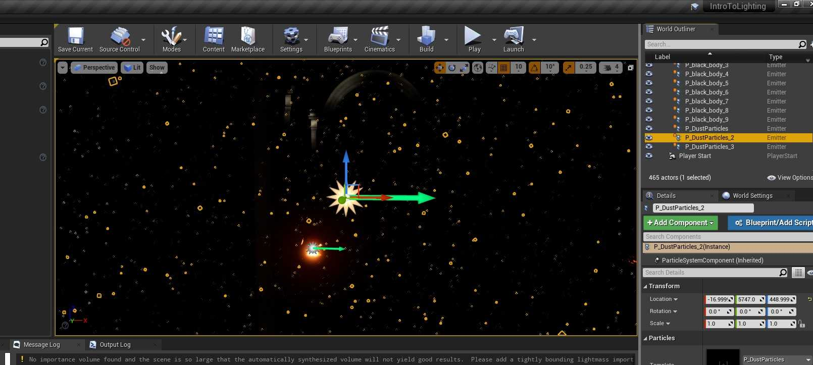
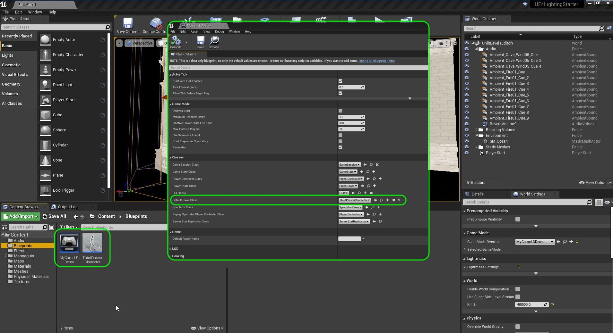

### Setting Up

[previous](../) • [home](../README.md#user-content-ue4-lighting) • [next](../)

We will be working with a level that has already ben grey blocked and modelled. It is a finished level minus the lighting. This was created by the team at Unreal and included in their Content Example project. You will also have a first person character to move through the environment.

 

---

| `required.software`\|`UE4 Materials`| 
| :--- |
| :floppy_disk: &nbsp; &nbsp; You will need to install the latest version of _UE4 4.26.x_ by downloading the [Epic Games Launcher](https://www.epicgames.com/store/en-US/download). You will also need a [GitHub](https://github.com/) account which is free to sign up for as we will be using version control. You will also need a mac or PC that is powerful enough to run unreal. If you are on a PC you will have to download and install [git](https://git-scm.com/downloads) (on a mac it may prompt you to install git as well but you can do it through the terminal). We will also install [Github Desktop](https://desktop.github.com) as it provides a GUI interface so you don't have to worry about command line. Once git is installed you will also need to download and install the [Git LFS (Large File System)](https://git-lfs.github.com) as well for both PC and mac.  You will also need access to Maya 2020..\n\nLets make sure you can see hidden folders. On the PC follow these [Windows 10 Turn on Hidden Folders](https://support.microsoft.com/en-us/help/4028316/windows-view-hidden-files-and-folders-in-windows-10) directions. On the Mac it is a bit more involved so go and [turn on hidden folders on Mac](https://ianlunn.co.uk/articles/quickly-showhide-hidden-files-mac-os-x-mavericks).|

##### `Step 1.`\|`SUU&G`|:small_blue_diamond:

If you have not installed the required software go and add [Epic Games Launcher](https://www.epicgames.com/store/en-US/download), [git](https://git-scm.com/downloads) (PC only), [Github Desktop](https://desktop.github.com), [Git LFS (Large File System)](https://git-lfs.github.com) (Large File System) on your mac or PC. Make sure you have a valid GitHub account. Make sure it has a 4.26.X in front of the version so that we know this walk through will be compatible with your version of Unreal.

##### `Step 2.`\|`FHIU`|:small_blue_diamond: :small_blue_diamond: 

After you accept the [GitHub Classroom](https://classroom.github.com/a/WqCC8uOJ) invitation, go to the new **GitHub** repository and click on the green Code button and select open with **GitHub Desktop** then confirm that you will open in desktop then pick a directory and press the <kbd>Clone</kbd> button.

##### `Step 3.`\|`SUU&G`|:small_blue_diamond: :small_blue_diamond: :small_blue_diamond:

Go to the directory in where you installed the project and open the LICENSE file in a text editor. If you want to change the type of license now is the time to do so. If you want to keep the MIT license then just replace `ENTER NAME HERE` with your legal name. Press save and quit.

##### `Step 4.`\|`SUU&G`|:small_blue_diamond: :small_blue_diamond: :small_blue_diamond: :small_blue_diamond:

Edit the README.md file in a text editor and add your name and a message (in my case it is a reminder that I will complete it at the end!). 

##### `Step 5.`\|`SUU&G`| :small_orange_diamond:

Move the `.gitattributes` file from the **Assets** folder into the top folder that contains the **Content** folder and **.gitignore** file.

##### `Step 6.`\|`SUU&G`| :small_orange_diamond: :small_blue_diamond:

Add a message stating change to **LICENSE**, **README.md** and **.gitattribute** files.  Press the **Commit** button.  Then press **Push** to update the change to **GitHub**.  

Check the repository online to see the added changes to make sure it pushed properly.

##### `Step 7.`\|`SUU&G`| :small_orange_diamond: :small_blue_diamond: :small_blue_diamond:

Open up **UE4LightingStarter.uproject**. The project should load up in the Room/Level **UnlitLevel**. It should look like a pitch black room as there are no lights. Also, the game may be building the shaders. You might want to wait for all the shaders to render before moving on.

##### `Step 8.`\|`SUU&G`| :small_orange_diamond: :small_blue_diamond: :small_blue_diamond: :small_blue_diamond:

You will also most likely see a dark room that has not been lit. To see what is going on swtich to **Unlit** mode. Next page we will start lighting the scene from scratch.

Lets look at what is included in this project. We have blocking volumes. These are collision volumes with no visible geometry. Press **BlockingVolume** and press the <kbd>F</kbd> key to focus on it. Notice that is is blocking the player from jumping outside the unblocked window archways.

The **Building Meshes** folder contains all the static meshes for the level.

##### `Step 9.`\|`SUU&G`| :small_orange_diamond: :small_blue_diamond: :small_blue_diamond: :small_blue_diamond: :small_blue_diamond:

Each of these meshes may or may not have a collision volume with the model.

##### `Step 10.`\|`SUU&G`| :large_blue_diamond:

**Illumination Volumes** folder contains the fog, ocean, and sky sphere that are not visible in the game currently. We will fix that shortly.

##### `Step 11.`\|`SUU&G`| :large_blue_diamond: :small_blue_diamond: 

We also have some cool particle effects included in the **Particles** folder that we will see better soon.

##### `Step 12.`\|`SUU&G`| :large_blue_diamond: :small_blue_diamond: :small_blue_diamond: 

The **Game Mode** loads up the **Blueprints | BP_ThirdPersonCharacter** that the **PlayerStart** object launches the player in the front terrace.

##### `Step 13.`\|`SUU&G`| :large_blue_diamond: :small_blue_diamond: :small_blue_diamond:  :small_blue_diamond: 

Now go into **Settings | World Settings** and expand **Game Mode**. This is overrides the settings that are in project settings for this one level. This is selecting our custom BP for Game Mode and **BP_ThirdPersonCharacter** as the **Default Pawn Class**. **The Default Pawn** is the game object that we are controlling in game. You will see all of these blueprints running and added to the scene when running the game.

Open up Project Settings. We also have the Lighting_Map room loading by default.

##### `Step 14.`\|`SUU&G`| :large_blue_diamond: :small_blue_diamond: :small_blue_diamond: :small_blue_diamond:  :small_blue_diamond: 

OK, now lets finish up this section by savin our work and uploading it to GitHub.  Press **Tile | Save All** then **Source Conrol | Submit to Source Control...** and add a description.  Press the <kbd>Submit</kbd> button.  Open up **GitHub Desktop** and **Push** the commited work.

___

| [previous](../)| [home](../README.md#user-content-ue4-lighting) | [next](../)|
|---|---|---|
