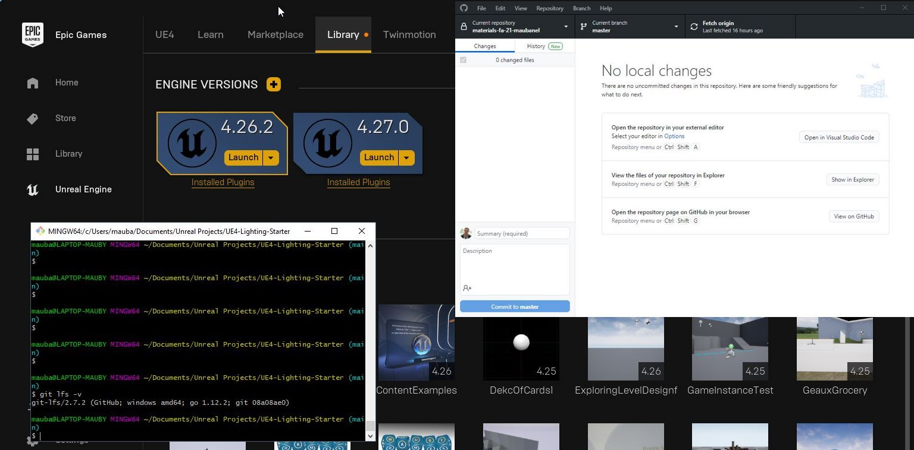
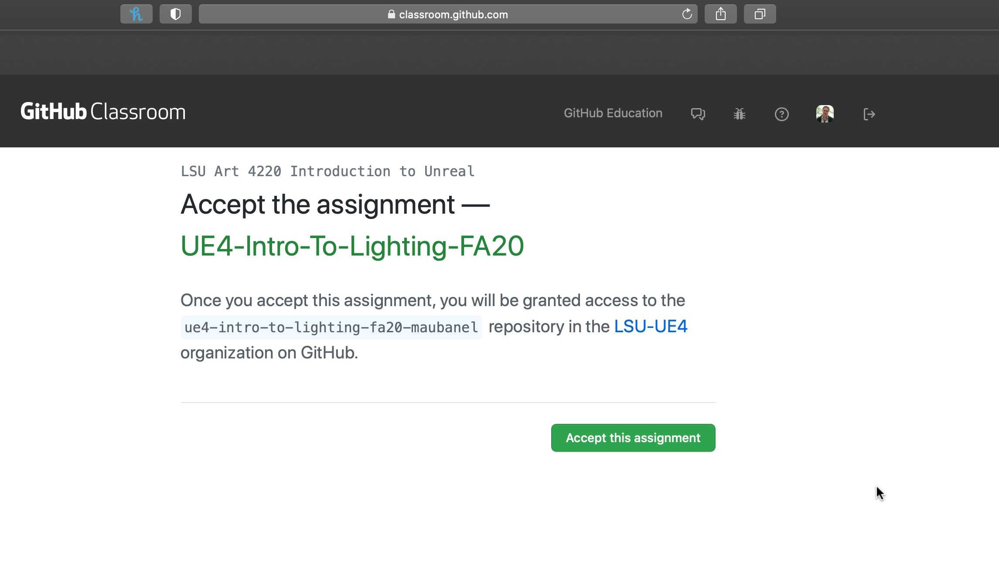
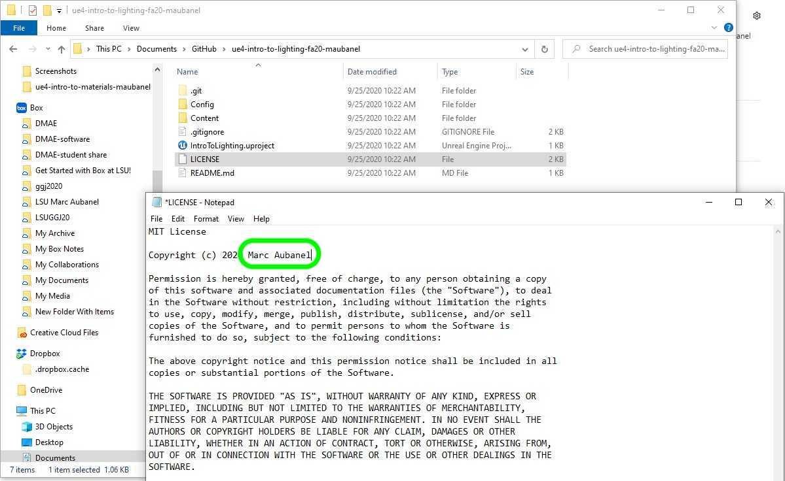
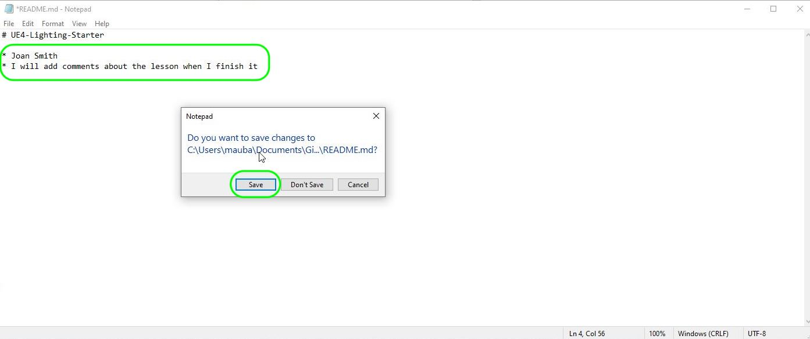
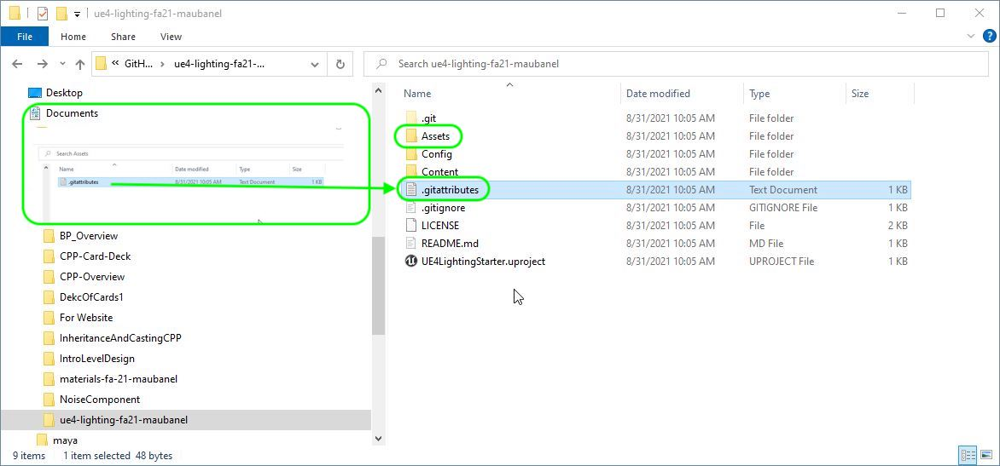
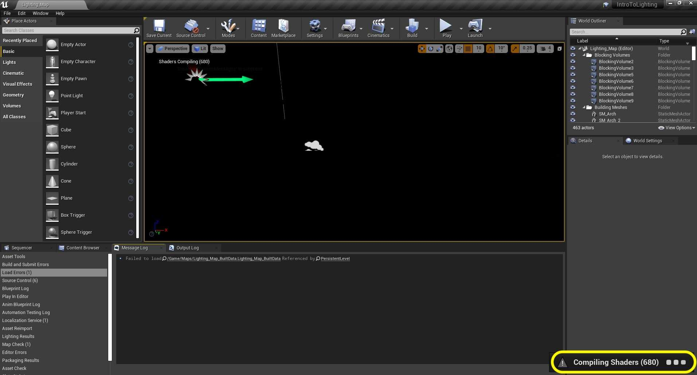
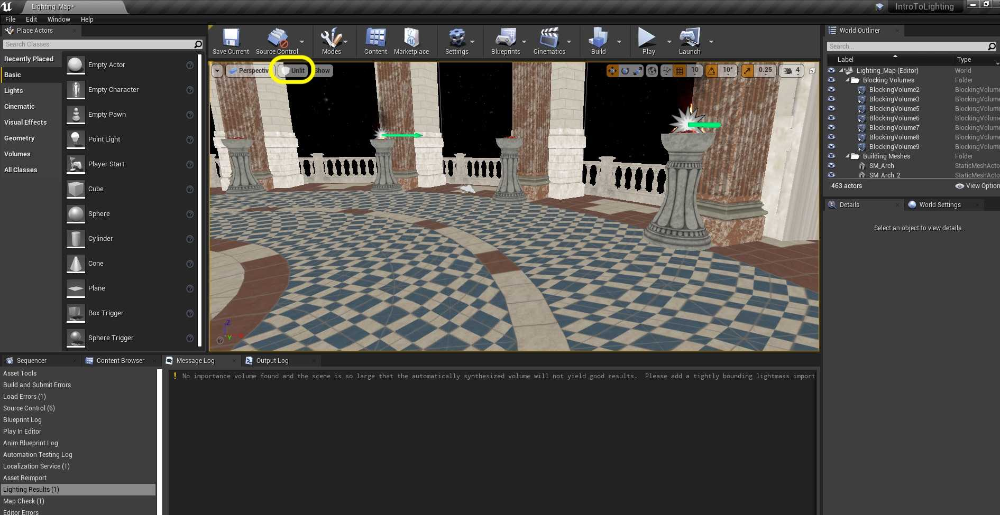
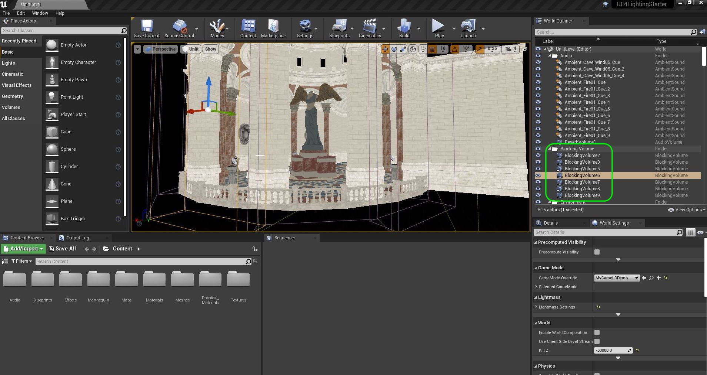
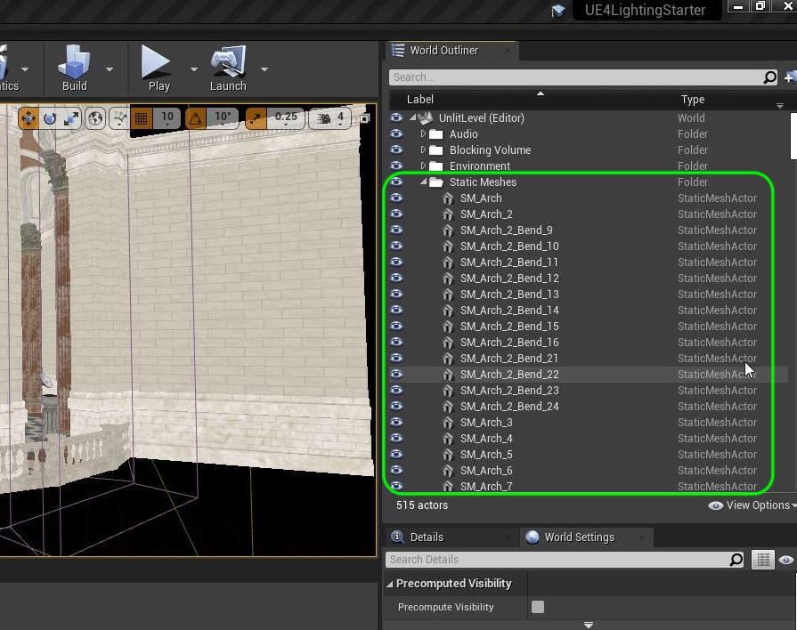
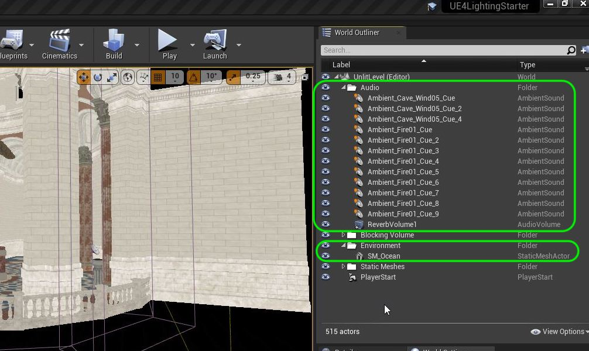

### Setting Up

[home](../README.md#user-content-ue4-lighting) • [next](../prep/README.md#user-content-lighting-prep)

We will be working with a level that has already ben grey blocked and modelled. It is a finished level minus the lighting. This was created by the team at Unreal and included in their Content Example project. You will also have a first person character to move through the environment.

 

---

| `required.software`\|`UE4 Materials`| 
| :--- |
| :floppy_disk: &nbsp; &nbsp; You will need to install the latest version of _UE4 4.26.x_ by downloading the [Epic Games Launcher](https://www.epicgames.com/store/en-US/download). You will also need a [GitHub](https://github.com/) account which is free to sign up for as we will be using version control. You will also need a mac or PC that is powerful enough to run unreal. If you are on a PC you will have to download and install [git](https://git-scm.com/downloads) (on a mac it may prompt you to install git as well but you can do it through the terminal). We will also install [Github Desktop](https://desktop.github.com) as it provides a GUI interface so you don't have to worry about command line. Once git is installed you will also need to download and install the [Git LFS (Large File System)](https://git-lfs.github.com) as well for both PC and mac.  You will also need access to Maya 2020..\n\nLets make sure you can see hidden folders. On the PC follow these [Windows 10 Turn on Hidden Folders](https://support.microsoft.com/en-us/help/4028316/windows-view-hidden-files-and-folders-in-windows-10) directions. On the Mac it is a bit more involved so go and [turn on hidden folders on Mac](https://ianlunn.co.uk/articles/quickly-showhide-hidden-files-mac-os-x-mavericks).|

##### `Step 1.`\|`SUU&G`|:small_blue_diamond:

If you have not installed the required software go and add [Epic Games Launcher](https://www.epicgames.com/store/en-US/download), [git](https://git-scm.com/downloads) (PC only), [Github Desktop](https://desktop.github.com), [Git LFS (Large File System)](https://git-lfs.github.com) (Large File System) on your mac or PC. Make sure you have a valid GitHub account. Make sure it has a 4.26.X in front of the version so that we know this walk through will be compatible with your version of Unreal.

##### `Step 2.`\|`FHIU`|:small_blue_diamond: :small_blue_diamond: 

After you accept the [GitHub Classroom](https://classroom.github.com/a/WqCC8uOJ) invitation, go to the new **GitHub** repository and click on the green Code button and select open with **GitHub Desktop** then confirm that you will open in desktop then pick a directory and press the <kbd>Clone</kbd> button.

##### `Step 3.`\|`SUU&G`|:small_blue_diamond: :small_blue_diamond: :small_blue_diamond:

Go to the directory in where you installed the project and open the LICENSE file in a text editor. If you want to change the type of license now is the time to do so. If you want to keep the MIT license then just replace `ENTER NAME HERE` with your legal name. Press save and quit.

##### `Step 4.`\|`SUU&G`|:small_blue_diamond: :small_blue_diamond: :small_blue_diamond: :small_blue_diamond:

Edit the README.md file in a text editor and add your name and a message (in my case it is a reminder that I will complete it at the end!). 

##### `Step 5.`\|`SUU&G`| :small_orange_diamond:

Move the `.gitattributes` file from the **Assets** folder into the top folder that contains the **Content** folder and **.gitignore** file.

##### `Step 6.`\|`SUU&G`| :small_orange_diamond: :small_blue_diamond:

Add a message stating change to **LICENSE**, **README.md** and **.gitattribute** files.  Press the **Commit** button.  Then press **Push** to update the change to **GitHub**.  

Check the repository online to see the added changes to make sure it pushed properly.

##### `Step 7.`\|`SUU&G`| :small_orange_diamond: :small_blue_diamond: :small_blue_diamond:

Open up **UE4LightingStarter.uproject**. The project should load up in the Room/Level **UnlitLevel**. It should look like a pitch black room as there are no lights. Also, the game may be building the shaders. You might want to wait for all the shaders to render before moving on.

##### `Step 8.`\|`SUU&G`| :small_orange_diamond: :small_blue_diamond: :small_blue_diamond: :small_blue_diamond:

You will also most likely see a dark room that has not been lit. To see what is going on swtich to **Unlit** mode. Next page we will start lighting the scene from scratch.

##### `Step 9.`\|`SUU&G`| :small_orange_diamond: :small_blue_diamond: :small_blue_diamond: :small_blue_diamond: :small_blue_diamond:

Lets look at what is included in this project. We have a **Blocking Volumes** folder that contains invisible meshes. These are collision volumes with no visible geometry. They are used to stop players from entering areas the designer doesn't want them to go in. Press **BlockingVolume6** and press the <kbd>F</kbd> key to focus on it. Notice that is is blocking the player from jumping outside the unblocked window archways.

##### `Step 10.`\|`SUU&G`| :large_blue_diamond:

The **Static Meshes** folder contains all the static meshes for the level.

##### `Step 11.`\|`SUU&G`| :large_blue_diamond: :small_blue_diamond: 

The **Audio** contains sound effects that you can hear in the level when you start the game and the **Environment** folder contains the ocean that we will activate shortly.

##### `Step 12.`\|`SUU&G`| :large_blue_diamond: :small_blue_diamond: :small_blue_diamond: 

The **Game Mode** loads up the **Blueprints | MyGameLDDemo** that the **PlayerStart** object launches the player in the front terrace. The **Blueprints** folder also contains **ThirdPersonCharacter** which is the **UE4** mannequin that we will control in the game. This character blueprint is the **Default Pawn** in the gamemode blueprint.

##### `Step 13.`\|`SUU&G`| :large_blue_diamond: :small_blue_diamond: :small_blue_diamond:  :small_blue_diamond: 

Open up **Settings | Project Settings | Maps and Modes**. It will start the editor and full game in the level `Unlit Level`. This is the dark room we are in. We also have **GameModeBase** which is the default gamemode for the entire project. 

Now go into **Settings | World Settings** and expand **Game Mode**. This is overrides the settings that are in project settings for this one level. So **MyGameLDDemo** is overriding the **GameModeBase** in the project level setting.  You can see when you expand the **Selected Game Mode** that the **Default Pawn** is `ThirdPersonCharacter`. 

___

| [home](../README.md#user-content-ue4-lighting) | [next](../prep/README.md#user-content-lighting-prep)|
|---|---|
