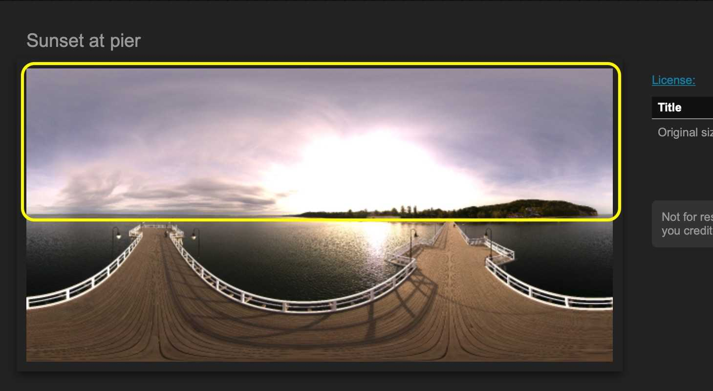
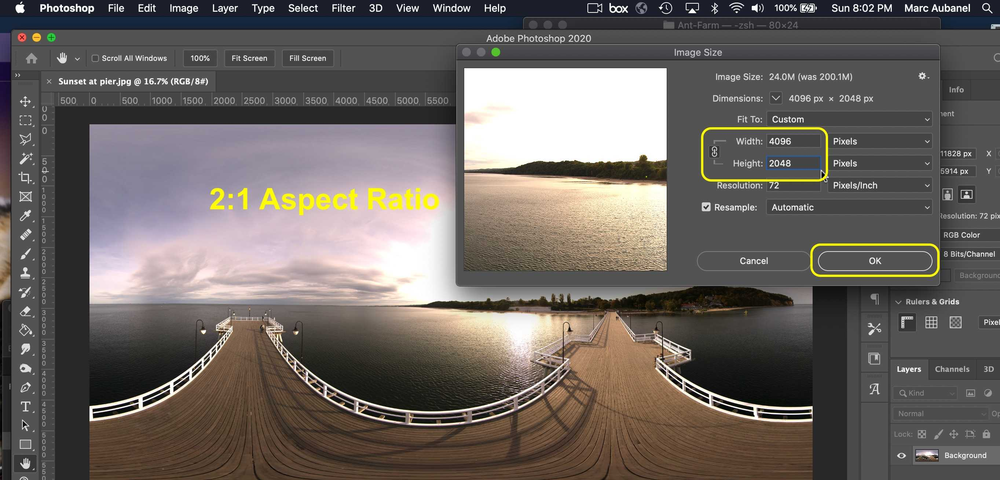
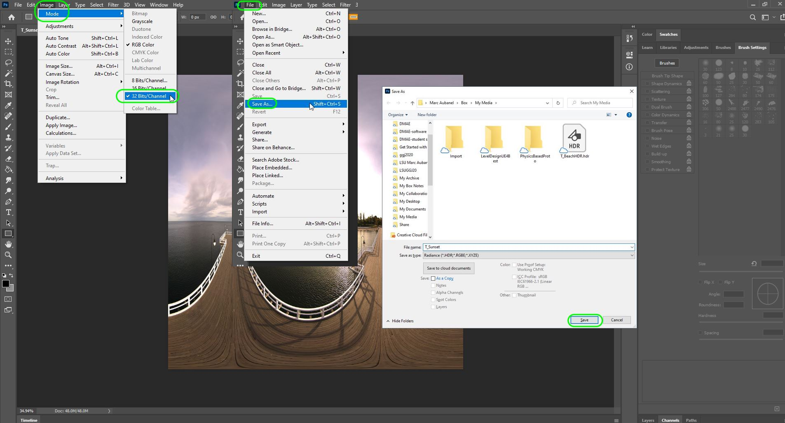
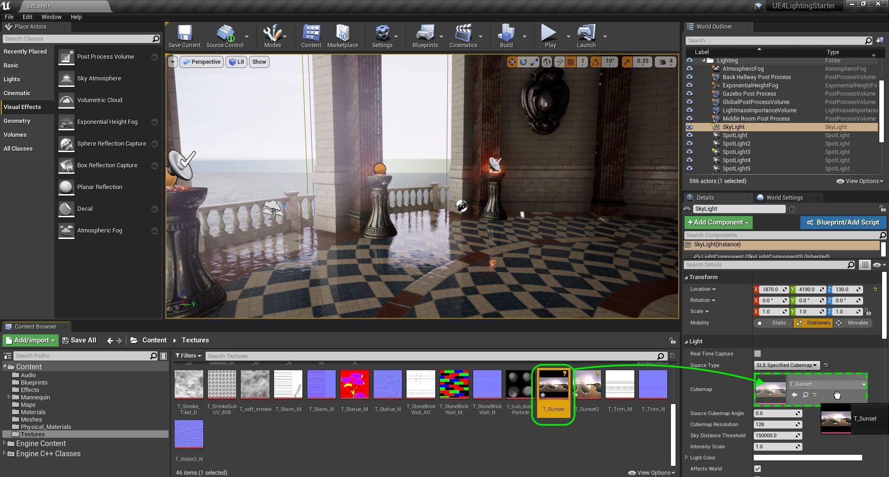
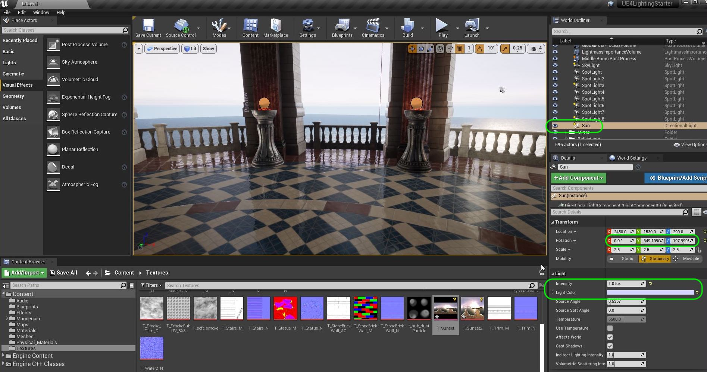
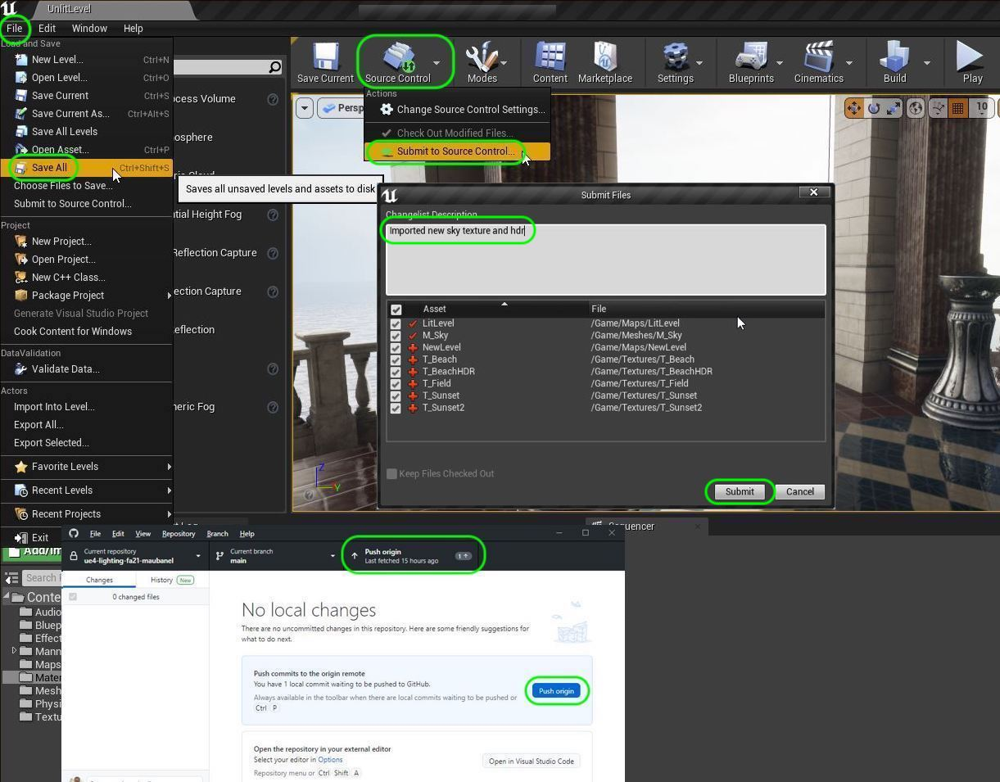

### Changing Sky Texture

[previous](../post-process/README.md#user-content-post-process-volumes) • [home](../README.md#user-content-ue4-lighting)

All of our lighting comes from the sky sphere and the models.  We can completely change the time of day or the mood by changing skyspheres.  Lets give that a shot.

 

---

##### `Step 1.`\|`ITL`|:small_blue_diamond:

You need to find an **equilateral panorama** (equirectangular) (ideally HDR) that is a 360 degree photo. You can find them online and one website is [texturify.com](https://texturify.com)

##### `Step 2.`\|`FHIU`|:small_blue_diamond: :small_blue_diamond: 

We don't care about the bottom half below the equator. That part of the globe is covered with water in the game engine. We just want the top half to be the sky, ideally by water to match the game scene.

##### `Step 3.`\|`ITL`|:small_blue_diamond: :small_blue_diamond: :small_blue_diamond:

Bring the image into Photoshop to do some simple formatting.

##### `Step 4.`\|`ITL`|:small_blue_diamond: :small_blue_diamond: :small_blue_diamond: :small_blue_diamond:

Click **Edit | Image Size** and select a size that is power of 2. I selected a height of `2048`. To match the game settings we want the width to be twice the width of the height. This is how the math is set up in the material.

##### `Step 5.`\|`ITL`| :small_orange_diamond:

Change the texture to a square ratio. The game engine needs a square texture to properly mip-map. The material also fixes the aspect ratio in its uvs. So we need to go back to Edit | Image Size and **unlock** the aspect ration lock and make the size `2048` by `2048`.

##### `Step 6.`\|`ITL`| :small_orange_diamond: :small_blue_diamond:

The image will look squished but the game engine will stretch it out again.

##### `Step 7.`\|`ITL`| :small_orange_diamond: :small_blue_diamond: :small_blue_diamond:

Export the image as a .png and a t_ before the name.

##### `Step 8.`\|`ITL`| :small_orange_diamond: :small_blue_diamond: :small_blue_diamond: :small_blue_diamond:

If you want to use it as an **HDR** in the skylight, you will to export another image as an **.hdr** (your image needs to be 32 bits). Go to **Image | Mode** and set the bit depth to `32 Bits/Channel`.  Then press **File | Save As...** and select `.hdr` as the file type.

##### `Step 9.`\|`ITL`| :small_orange_diamond: :small_blue_diamond: :small_blue_diamond: :small_blue_diamond: :small_blue_diamond:

Go to the game and open **Meshes | M_Sky**. Look for the texture to edit. Select the texture you exported (the png not the hdr). Press the <kbd>Apply</kbd> button.

##### `Step 10.`\|`ITL`| :large_blue_diamond:

Now go to the **Sky Light** in the level and update the **HDRI** with the one you exported from photoshop (the 32 bit per channel image).  Now ideally you have a native raw HDMI.

##### `Step 11.`\|`ITL`| :large_blue_diamond: :small_blue_diamond: 

Now adjust the sun to lower to the horizon as this is near sunset.  I also match the **Sun** color to match the cool bluish/purple sky. I reduce the intensity to an evening light. 

##### `Step 12.`\|`ITL`| :large_blue_diamond: :small_blue_diamond: :small_blue_diamond: 

I didn't build the lighting but took a quick look around at a different global lighting scenario based on the a new sky texture.

https://user-images.githubusercontent.com/5504953/131925562-515a33b3-6271-44ba-be3d-53e03218ef6f.mp4

##### `Step 13.`\|`ITL`| :large_blue_diamond: :small_blue_diamond: :small_blue_diamond:  :small_blue_diamond: 

Press **File | Save All** and press **Source Control |  Submit to Source Control...** and enter a **Description** then press the <kbd>Submit</kbd> button. Open up **GitHub Desktop** and press the <kbd>Push</kbd> button. Now we are updated.

___

| [previous](../post-process/README.md#user-content-post-process-volumes)| [home](../README.md#user-content-ue4-lighting) | 
|---|---|
